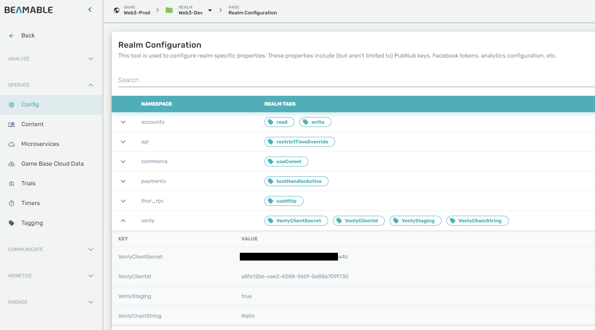

# Beamable Venly Sample

Welcome to the Beamable Venly Sample project that demonstrates how
to integrate the [Venly](https://www.venly.io/) services into a [Beamable](https://beamable.com/) powered game. We'll
use two Beamable federation features:

- [Federated Authentication](https://github.com/beamable/FederatedAuthentication) - will create Venly custodial wallet
  for each player
- [Federated Inventory](https://github.com/beamable/FederatedInventory) - will mint NFTs for federated inventory items
  and FTs for federated inventory currency

## Requirements

Before getting started, please head to [Beamable](https://beamable.com/) and [Venly](https://portal.venly.io/) to create
required accounts.
You should have the following tools installed on your development machine.

1. [Unity 2021](https://unity.com/download)
2. [Docker](https://www.docker.com/products/docker-desktop/)
3. [Net7](https://dotnet.microsoft.com/en-us/download/dotnet/7.0)
4. [Git](https://git-scm.com/downloads)

## Repository structure

- /FederationMicroservice - Beamable standalone microservice that implements federation features and communicates with
  Venly.
- /SampleUnityProject - Unity project with Beamable SDK and basic UI to showcase the E2E flow.

## Getting Started

Navigate into the ```/FederationMicroservice``` directory and run this commands to initialize the Beamable CLI and
connect the service to your Beamable organization and game:

```shell
dotnet tool restore
dotnet beam init --save-to-file
```

### Configuration

Configuration defaults are hard-coded inside **FederationMicroservice/services/VenlyFederation/Configuration.cs**  
You can override the values using the realm configuration.  


**Default values:**

| **Namespace** | **Key**                             | **Default value**                                                                            | **Description**                                                                                                                        |
|---------------|-------------------------------------|----------------------------------------------------------------------------------------------|----------------------------------------------------------------------------------------------------------------------------------------|
| venly         | VenlyClientId                       |                                                                                              | Venly client ID (find this in Venly portal)                                                                                            |
| venly         | VenlyClientSecret                   |                                                                                              | Venly client secret (find this in Venly portal)                                                                                        |
| venly         | VenlyChainString                    | Matic                                                                                        | Venly chain                                                                                                                            |
| venly         | VenlyStaging                        | true                                                                                         | Use Venly staging environment                                                                                                          |
| venly         | DefaultContractName                 | Game Contract Polygon                                                                        | Name for the default contract                                                                                                          |
| venly         | DefaultContractDescription          | Default game contract used for minting game tokens                                           | Description for the default contract                                                                                                   |
| venly         | DefaultContractImageUrl             | [link](https://upload.wikimedia.org/wikipedia/commons/0/02/Beamable_Inc_Color_Logo_2015.png) | Image for the default contract                                                                                                         |
| venly         | DefaultContractExternalUrl          | https://beamable.com/                                                                        | External url for the default contract                                                                                                  |
| venly         | TransactionConfirmationPoolMs       | 1000                                                                                         | Delay for transaction confirmation pooling in ms                                                                                       |
| venly         | MaxTransactionPoolCount             | 20                                                                                           | Maximum transaction pool count                                                                                                         |
| venly         | DelayAfterTransactionConfirmationMs | 16000                                                                                        | Delay after a tx is confirmed, before fetching the tokens for the player. Workaround for the Venly caching issue (fix is in progress). |

**IMPORTANT:** Make sure to save the VenlyClientId and VenlyClientSecret in realm config before publishing the
microservice.

### Federated content

This sample project includes one Venly federated item ```items.blockchain_items.small_cat```, and one Venly federated
currency ```items.currency.blockchain_currency.gold```
You can enable federation on any item or currency. To checkout the content definitions, open the Beamable Content
Mangager in ```SampleUnityProject```.

**IMPORTANT:** Make sure to publish the content using the content manager.

### Deploy and test

- Run ```dotnet beam services deploy``` to deploy the federation service
- Run the ```SampleUnityProject```
- Use the Beamable Portal to grant players federated inventory items